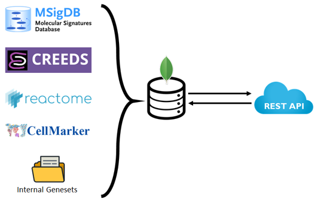
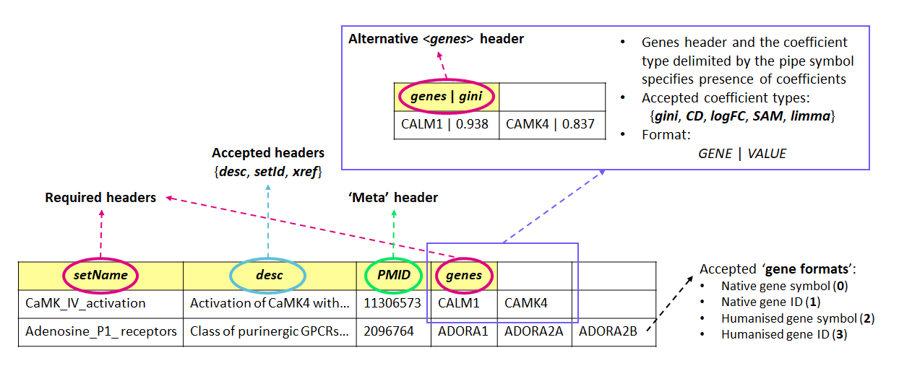

<h1 align="center">:gem: GeMS :gem:</h1>
<h2 align="center">Geneset Management System</h2>

<p align="center">
  
</p>
GeMS is an open source project that provides a lightweight framework for deploying a geneset management system locally using MongoDB and Flask.

### Project Aims

- Central repository for storing geneset references
- Introduce new GMTx file format for storing geneset-related data
- Provide programmatic access to the database with a RESTful API

### Group Members

- Albert Kang (*swk30@cam.ac.uk*)
- Laura Badi (*badilla@gmx.ch*)

# Contents
<!--ts-->
   * [1. For General Users](#1-for-general-users)
     * [1.1. Uploading Genesets](#11-uploading-genesets)
     * [1.2. Programmatic Access to Genesets](#12-programmatic-access-to-genesets)
   * [2. For Developers](#2-for-developers)
<!--te-->

# 1. For General Users

## 1.1. Uploading Genesets

### What is a GMTx file?

<p align="center">
  
</p>

- Like GMT files:
	- It is a tab-delimited text file
	- The trailing tail columns represent the membership genes
	
- Unlike GMT files:
	- GMTx files allow metadata on top of geneset names and geneset descriptions
	- GMTx files allow coefficients attached to a membership gene to be stored 

- See the explanation of the GMT file format here: *https://software.broadinstitute.org/cancer/software/gsea/wiki/index.php/Data_formats#GMT:_Gene_Matrix_Transposed_file_format_.28.2A.gmt.29*

- GMTx file format on top of the GMT file format is as follows:
	- GMTx files require row 1 to be contain column headers:
		- ...accepted headers are: `setName`, `genes`, `xref`, `setId`, `desc`
		- ... any other header names will be considered as a 'meta-tag'
	- GMTx files MUST include the following headers: `setName` and `genes`
		- ... `setName` SHOULD be the first header column
		- ... `genes` MUST be the last header column 
	- Membership gene can be written in the following formats:
		- ... `GENE` (as in regular GMT files)
		- ... `GENE | VALUE`  (new to GMTx files)

Instructions for converting to the GMTx file format can be found here: *./GeMS/src/x_to_gmtx_converter* 

### Dependencies
```
pip install gunicorn
pip install pymongo
pip install flask
pip install flask_restful
pip install xmltodict
```

### How to upload

The main upload logic is here: *\GeMS\src\api\upload.py*

The CLI arguments are as follows:

| Args   | Name              | Required  | Examples                |
|:------:|:-----------------:|:---------:|:----------------------- |
| `--fl` | File location     | O         |                         |
| `--gf` | Gene format       | O         | 0, 1, 2, 3              |
| `--so` | Source            | O         | Roche, MSigDB...        |
| `--ti` | NCBI Taxonomy ID  | O         | 9606, 10090...          |
| `--us` | User              | O         | Public, badil...        |
| `--st` | Subtype           | X         | C7, BP...               |
| `--do` | Domain            | X         | pathway, cell marker... |

### Single GMTx file upload (Example: Reactome)
```
[\GeMS\src\api\] python upload.py --fl ../../data/Reactome/ReactomePathways.gmtx --gf 0 --so Reactome --ti 9606 --us Public --do pathway
```

### Bulk upload on HPC (Reactome, CellMarker, CREEDS and MSigDB)
```
[\GeMS\] chmod +x upload.sh
[\GeMS\] sbatch -J bulkUpload -o bulkUpload.out -e bulkUpload.err --ntasks=1 --qos=normal --cpus-per-task=16 --wrap="./upload.sh"
```

## 1.2. Programmatic Access to Genesets

You can query the genesets stored in GeMS using our REST-API service. A detailed explanation of the supported tools and services
can be found here: *./GeMS/src/api*


### 1.2.1. R client in ribiosGSEA

From version 1.4.0, ribiosGSEA supports reading, inserting, and removing genesets from GeMS. See the vignette 'working-with-GeMS' of the <A href='https://github.com/Accio/ribios.git'>ribiosGSEA</a> package.
# 2. For Developers

### `src` layout
	.
    ├── ...
    ├── src
    │   │
    │   ├── api                    Flask REST-API and GMTx file loader
    │   │   │
    │   │   ├── db_utils.py        Database configuration
    │   │   │   
    │   │   ├── app.py             Main: Flask REST-API
    │   │   ├── app_utils.py       Helper functions for quantifying geneset similarity
    │   │   ├── wsgi.py            WSGI production server interface (for use with *gunicorn*)
    │   │   │   
    │   │   ├── upload.py          Main: GMTx upload + API upload
    │   │   ├── db_utils.py        GeMS database initialisation logic
    │   │   ├── map_utils.py       Use NCBI collections to infer gene IDs and symbols
    │   │   ├── gmtx_utils.py      Helper functions for parsing GMTx files
    │   │   │   
    │   │   └── README.md          Documentation for the REST-API
    │   │	
    │   ├── ncbi_gene_mapper       Deprecated: NCBI Gene and Homologene to MongoDB 
    │   └── x_to_gmtx_converter    Conversion to GMTx files
    └── ...

### Deploying RESTful-Flask application on a local machine - Docker required

```
cp start_podman.sh start_podman_localhost.sh

```
Edit start_podman_localhost.sh and change ENV variables to configure the connection to MongoDB instance
  
Then run:
```
bash start_podman_localhost.sh

```

### Working with hierarchies

```
db.getCollection('GeMS_set2set').aggregate([{
   $graphLookup: {
      from: 'GeMS_set2set',
      startWith: '$setId',
      connectFromField: 'setId',
      connectToField: 'parentId',
      as: 'children',
      maxDepth: 10,
      depthField: 'depth'
   }
}])
```
# GeMS
